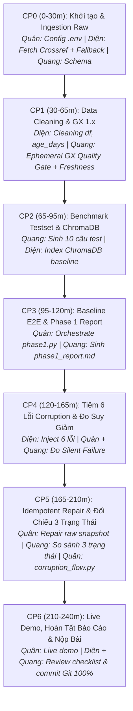

# KẾ HOẠCH HÀNH ĐỘNG DỰ ÁN (MASTER PLAN): DAY 10 - DATA PIPELINE & DATA OBSERVABILITY

> **Dự án:** K4-L3B-Day10 — Data Pipeline & Data Observability for RAG  
> **Thời lượng thực chiến:** 240 phút (09:00 – 13:00) | **Hạn nộp LMS:** 23:59:59  
> **Quy mô nhóm:** 3 thành viên  
> **Mục tiêu điểm số:** **105/100 điểm** (100 điểm chuẩn + 5 điểm Bonus Auto-Repair / Dashboard)  
> **LLM Provider:** Google Gemini (`gemini-2.5-flash`) + Local Fallback Snapshot Crossref

---

## 1. Phân Chia Vai Trò & Trách Nhiệm Thành Viên (Team 3 Người)

Nhóm 3 người được phân bổ theo 3 luồng công việc độc lập nhưng tích hợp chặt chẽ theo hợp đồng dữ liệu (Data Contract):

```
┌─────────────────────────────────────────────────────────────────────────────────┐
│                    THÀNH VIÊN 1: LÂM QUANG ANH QUÂN (TEAM LEAD)                 │
│         Pipeline Orchestration, System Core, Báo Cáo & Điều Phối Live Demo       │
│  Files: src/core/config.py, src/pipelines/phase1.py, corruption_flow.py        │
│  Reports: report/group_report.md, docs/TEAM.md, docs/SUBMISSION.md             │
└──────────────────────────────────────┬──────────────────────────────────────────┘
                                       │ Điều phối luồng dữ liệu
        ┌──────────────────────────────┴──────────────────────────────┐
        ▼                                                             ▼
┌─────────────────────────────────────────┐   ┌─────────────────────────────────────────┐
│   THÀNH VIÊN 2: NGUYỄN VĂN DIỆN         │   │      THÀNH VIÊN 3: BÙI VĂN QUANG        │
│     (DATA FOUNDATION & VECTOR INDEX)    │   │      (OBSERVABILITY & EVALUATION)       │
│ Ingestion, Cleaning, ChromaDB &         │   │ Great Expectations 1.x, Freshness SLA,  │
│ Corruption Suite                        │   │ Evaluation Testset & Markdown Reporting │
│ Files:                                  │   │ Files:                                  │
│ - src/ingestion/crossref.py             │   │ - src/observability/quality.py (GX 1.x) │
│ - src/ingestion/cleaning.py             │   │ - src/evaluation/testset.py             │
│ - src/ingestion/corruption.py           │   │ - src/observability/reporting.py        │
│ - src/retrieval/index.py & embeddings.py│   │ - src/evaluation/metrics.py             │
│ Deliverables:                           │   │ Deliverables:                           │
│ - data/raw/ & data/clean/ artifacts     │   │ - data/quality/ & data/eval/ testset    │
│ - ChromaDB collections                  │   │ - Freshness report & GX suite report    │
│ - 6 lỗi Corruption Suite                │   │ - Bonus B2: Auto Self-Healing Gate      │
└─────────────────────────────────────────┘   └─────────────────────────────────────────┘
```

### Bảng Phân Công Công Việc Chi Tiết:

| Thành viên | Vai trò | Module & File phụ trách | Deliverables (Sản phẩm bàn giao) | Trách nhiệm Git & Báo cáo |
| :--- | :--- | :--- | :--- | :--- |
| **Lâm Quang Anh Quân**<br>*(Lead - `2A202602467`)* | **Pipeline Orchestrator & Integrator** | - [`src/core/config.py`](src/core/config.py)<br>- [`src/core/utils.py`](src/core/utils.py)<br>- [`src/pipelines/phase1.py`](src/pipelines/phase1.py)<br>- [`src/pipelines/corruption_flow.py`](src/pipelines/corruption_flow.py)<br>- [`script/run_phase1.py`](script/run_phase1.py)<br>- [`script/run_corruption_flow.py`](script/run_corruption_flow.py) | - Đảm bảo chạy 2 kịch bản exit code 0<br>- Đồng bộ artifact giữa các pha<br>- Lập kịch bản Live Demo (3-5 phút)<br>- Bảng so sánh 3 trạng thái trong console<br>- Điều phối luồng Idempotent Repair | - Quản lý nhánh `Quan`, điều phối PR merge vào `develop`<br>- Cập nhật [`docs/TEAM.md`](docs/TEAM.md)<br>- Hoàn thiện [`report/group_report.md`](report/group_report.md)<br>- Báo cáo cá nhân [`report/2A202602467_LamQuangAnhQuan.md`](report/2A202602467_LamQuangAnhQuan.md) |
| **Nguyễn Văn Diện**<br>*(Member - `2A202602615`)* | **Data Foundation & Vector Index Engineer** | - [`src/ingestion/crossref.py`](src/ingestion/crossref.py)<br>- [`src/ingestion/cleaning.py`](src/ingestion/cleaning.py)<br>- [`src/ingestion/corruption.py`](src/ingestion/corruption.py)<br>- [`src/retrieval/index.py`](src/retrieval/index.py)<br>- [`src/retrieval/embeddings.py`](src/retrieval/embeddings.py) | - `data/raw/crossref_response.json`<br>- `data/raw/crossref_records.json`<br>- `data/clean/papers_clean.csv` & `.json`<br>- ChromaDB collections: `papers-baseline`, `papers-corrupted`, `papers-repaired`<br>- `data/results/corruption_log.json`<br>- 6 kịch bản Data Corruption | - Nhánh `VanDien`, commit Ingestion, Cleaning, Indexing & Corruption<br>- Đảm bảo data lineage không bị mất mát dữ liệu gốc<br>- Báo cáo cá nhân [`report/2A202602615_NguyenVanDien.md`](report/2A202602615_NguyenVanDien.md) |
| **Bùi Văn Quang**<br>*(Member - `2A202602688`)* | **Data Observability & Evaluation Specialist** | - [`src/observability/quality.py`](src/observability/quality.py)<br>- [`src/observability/reporting.py`](src/observability/reporting.py)<br>- [`src/evaluation/testset.py`](src/evaluation/testset.py)<br>- [`src/evaluation/metrics.py`](src/evaluation/metrics.py)<br>- **Bonus:** Auto Self-Healing logic | - Cấu hình Great Expectations 1.x ephemeral<br>- Freshness SLA Check (`age_days > 180`)<br>- `data/quality/*_quality_report.json`<br>- `data/eval/test_set.json` (10 câu benchmark)<br>- `data/reports/phase1_report.md`<br>- `data/reports/corruption_report.md` | - Nhánh `Quang`, commit Quality & Evaluation<br>- Đảm bảo cú pháp GX 1.x chuẩn xác không crash<br>- Báo cáo cá nhân [`report/2A202602688_BuiVanQuang.md`](report/2A202602688_BuiVanQuang.md) |

---

## 2. Lộ Trình Triển Khai Chi Tiết Theo Thời Gian (240 Phút - CP0 đến CP6)



---

### ⏰ Checkpoint 0: Khởi Tạo Môi Trường & Ingestion Raw Data (30 phút)
- **Mục tiêu:** Thiết lập môi trường Python, kiểm tra `.env` hợp lệ, thu thập metadata qua Crossref API và bảo toàn dữ liệu gốc.
- **Nhiệm vụ cụ thể:**
  - **Quân (TV1):** Kiểm tra cấu hình hệ thống, thiết lập API Key (`GOOGLE_API_KEY`) trong `.env`, xác nhận các đường dẫn trong [`src/core/config.py`](src/core/config.py).
  - **Diện (TV2):** Lập trình trong [`src/ingestion/crossref.py`](src/ingestion/crossref.py):
    - Viết hàm `parse_crossref_payload()` trích xuất các trường: `paper_id` (DOI), `title`, `summary` (abstract loại bỏ JATS XML), `authors`, `categories`, `published`, `updated`, `abs_url`, `pdf_url`.
    - Viết hàm `fetch_source_records()`: gọi Live API Crossref; nếu gặp lỗi mạng hoặc HTTP 429/503 thì tự động fallback đọc từ `data/raw/crossref_response.json`.
    - Viết hàm `load_raw_records()`: đọc snapshot JSON và map thành `list[PaperRecord]`.
    - Lưu 2 file raw artifacts: `data/raw/crossref_response.json` và `data/raw/crossref_records.json`.
  - **Quang (TV3):** Xác minh tính hợp lệ của schema `PaperRecord` và số lượng bản ghi (đủ 24 bài báo).
- **Lệnh nghiệm thu CP0:**
  ```bash
  python -c "import chromadb, great_expectations, sentence_transformers; print('Môi trường sẵn sàng')"
  python -c "from core.config import load_settings; from ingestion.crossref import fetch_source_records; s=load_settings(); r=fetch_source_records(s); print(f'Tín hiệu hoàn thành: Đã tải {len(r)} bài báo')"
  ```

---

### ⏰ Checkpoint 1: Data Cleaning & Data Observability (GX 1.x & Freshness) (35 phút)
- **Mục tiêu:** Tiền xử lý, chuẩn hóa `text_for_embedding`, tính `age_days` và thiết lập chốt kiểm dịch chất lượng tự động theo chuẩn GX 1.x cùng Freshness SLA.
- **Nhiệm vụ cụ thể:**
  - **Diện (TV2):** Hoàn thiện `build_clean_dataframe()` trong [`src/ingestion/cleaning.py`](src/ingestion/cleaning.py):
    - Khử trùng lặp theo `paper_id`.
    - Parse ngày xuất bản `published` và tính `age_days = (run_date - published).days`.
    - Tạo các cột phụ trợ: `authors_joined`, `categories_joined`, `summary_chars`.
    - Ghép cột `text_for_embedding` gồm 5 phần chuẩn: Title, Authors, Published, Categories, Summary.
  - **Quang (TV3):** Lập trình trong [`src/observability/quality.py`](src/observability/quality.py):
    - Cấu hình Great Expectations 1.x Ephemeral Context:
      ```python
      context = gx.get_context(mode="ephemeral")
      data_source = context.data_sources.add_pandas(name="papers_source")
      data_asset = data_source.add_dataframe_asset(name="papers_asset")
      batch_def = data_asset.add_batch_definition_whole_dataframe("papers_batch")
      batch = batch_def.get_batch(batch_parameters={"dataframe": df})
      ```
    - Khởi tạo 4 Expectations bắt buộc:
      1. `ExpectTableRowCountToBeBetween(min_value=15, max_value=50)`
      2. `ExpectColumnValuesToNotBeNull(column="paper_id")`
      3. `ExpectColumnValuesToBeUnique(column="paper_id")`
      4. `ExpectColumnValueLengthsToBeBetween(column="summary", min_value=20)`
    - Hoàn thiện hàm `build_freshness_report()`: Tính toán tỷ lệ bản ghi có `age_days > 180`, nếu vượt quá 25% thì kích hoạt cảnh báo `is_fresh = False`.
- **Lệnh nghiệm thu CP1:**
  ```bash
  python -c "from datetime import datetime, timezone; from core.config import load_settings; from ingestion.crossref import load_raw_records; from ingestion.cleaning import build_clean_dataframe; s=load_settings(); df=build_clean_dataframe(load_raw_records(s.paths.raw_records_json), datetime.now(timezone.utc)); print(f'Tín hiệu hoàn thành: Clean thành công {len(df)} dòng')"
  python -c "from core.config import load_settings; from observability.quality import run_data_quality_checks; import pandas as pd; s=load_settings(); df=pd.read_json(s.paths.clean_json); res=run_data_quality_checks(df, s, 'test'); print(f'Tín hiệu hoàn thành: Quality check status = {res[\"success\"]}')"
  ```

---

### ⏰ Checkpoint 2: Benchmark Test Set & ChromaDB Vector Store Indexing (30 phút)
- **Mục tiêu:** Xây dựng bộ test đánh giá chuẩn hóa 10 câu hỏi qua 4 nhóm nghiệp vụ và đánh chỉ mục vector trên ChromaDB.
- **Nhiệm vụ cụ thể:**
  - **Quang (TV3):** Lập trình `build_test_set()` trong [`src/evaluation/testset.py`](src/evaluation/testset.py):
    - Tạo 10 câu hỏi bao phủ 4 nhóm nghiệp vụ: `summary` (3 câu), `authors` (3 câu), `date` (2 câu), `categories` (2 câu).
    - Cấu trúc từng câu hỏi định dạng `'<Title>'` để khớp hoàn hảo với logic trích xuất của QA Agent:
      - Ví dụ: `Who authored 'Agentic Retrieval-Augmented Generation for Knowledge-Intensive Tasks'?`
    - Lưu kết quả ra `data/eval/test_set.json`.
  - **Diện (TV2):** Quản lý lớp `LocalEmbeddingIndex` trong [`src/retrieval/index.py`](src/retrieval/index.py) & [`src/retrieval/embeddings.py`](src/retrieval/embeddings.py), chạy nạp vector embedding `all-MiniLM-L6-v2` cho toàn bộ tài liệu sạch vào collection `papers-baseline`.
- **Lệnh nghiệm thu CP2:**
  ```bash
  python -c "from core.config import load_settings; from evaluation.testset import build_test_set; import pandas as pd; s=load_settings(); df=pd.read_json(s.paths.clean_json); ts=build_test_set(df, s.paths.eval_testset); print(f'Tín hiệu hoàn thành: Sinh được {len(ts)} câu hỏi test')"
  ```

---

### ⏰ Checkpoint 3: Baseline Pipeline End-to-End & Báo Cáo Pha 1 (25 phút)
- **Mục tiêu:** Chạy end-to-end chu trình dữ liệu sạch, kiểm thử RAG Agent và xuất báo cáo đo lường chỉ số nền.
- **Nhiệm vụ cụ thể:**
  - **Quân (TV1):** Hoàn thiện [`src/pipelines/phase1.py`](src/pipelines/phase1.py) liên kết trọn vẹn: Load Settings → Ingestion / Load Raw → Clean Data → Index ChromaDB → Build Test Set → Evaluate Pipeline → Run Quality & Freshness → Generate Report.
  - **Quang (TV3):** Hoàn thiện hàm `generate_phase1_report()` trong [`src/observability/reporting.py`](src/observability/reporting.py) xuất file `data/reports/phase1_report.md`.
  - **Diện (TV2):** Kiểm tra xác thực các artifacts: `papers_clean.csv`, `papers_clean.json`, `baseline_metrics.json`.
- **Lệnh nghiệm thu CP3:**
  ```bash
  python script/run_phase1.py
  ```
  File `data/results/baseline_metrics.json` và `data/reports/phase1_report.md` được sinh ra với `retrieval_hit_rate >= 0.8` và `mean_token_f1 >= 0.7`.

---

### ⏰ Checkpoint 4: Synthetic Data Corruption Suite & Đo Lường Suy Giảm (45 phút)
- **Mục tiêu:** Giả lập sự cố dữ liệu bẩn bằng cách tiêm 6 kịch bản lỗi, chứng minh Data Quality Gate báo động và Agent suy giảm chất lượng (**Silent Failure**).
- **Nhiệm vụ cụ thể:**
  - **Diện (TV2):** Triển khai hàm `corrupt_clean_dataframe()` trong [`src/ingestion/corruption.py`](src/ingestion/corruption.py):
    1. *Drop latest records:* Xóa 20% bản ghi mới nhất (khoảng 4-5 bài).
    2. *Blank summary:* Xóa rỗng trường summary của 2 bản ghi.
    3. *Inject noise:* Chèn chuỗi ký tự rác vào summary của 2 bản ghi.
    4. *Truncate title:* Cắt ngắn tiêu đề xuống `< 8` ký tự cho 2 bản ghi.
    5. *Stale date:* Lùi ngày xuất bản về quá khứ 5 năm (vi phạm Freshness SLA).
    6. *Duplicate rows:* Nhân bản 2 dòng có sẵn để kiểm tra lỗi unique ID.
    - Cập nhật lại chuỗi `text_for_embedding` trên dữ liệu đã bị làm bẩn.
    - Ghi chi tiết toàn bộ các can thiệp vào `data/results/corruption_log.json`.
  - **Quân (TV1) & Quang (TV3):** Index tập dữ liệu lỗi vào ChromaDB collection `papers-corrupted`, chạy đánh giá qua tập test set 10 câu hỏi, lưu kết quả ra `data/results/corrupted_metrics.json`.
  - **Quan sát kết quả:** Data Quality Gate báo lỗi (`success = False`), Freshness báo `is_fresh = False`, các chỉ số `retrieval_hit_rate` và `mean_token_f1` giảm sút rõ rệt.
- **Nghiệm thu CP4:**
  `data/results/corruption_log.json` và `data/results/corrupted_metrics.json` tồn tại đầy đủ và phản ánh rõ sự suy giảm.

---

### ⏰ Checkpoint 5: Idempotent Repair & Báo Cáo Đối Chiếu 3 Trạng Thái (45 phút)
- **Mục tiêu:** Tự động kích hoạt cơ chế phục hồi dữ liệu an toàn (Idempotent Repair) từ nguồn Raw đáng tin cậy, xuất báo cáo so sánh định lượng 3 trạng thái.
- **Nhiệm vụ cụ thể:**
  - **Quân (TV1):** Hoàn thiện [`src/pipelines/corruption_flow.py`](src/pipelines/corruption_flow.py) chạy trọn vẹn chu trình:
    `Clean Data` → `Corrupt Data` → `Index Corrupted` → `Evaluate Corrupted` → `Quality Check Corrupted` → `Idempotent Repair` → `Index Repaired` → `Evaluate Repaired` → `Quality Check Repaired` → `Generate Comparison Report`.
  - **Diện (TV2):** Triển khai logic Idempotent Repair: đọc lại dữ liệu gốc từ snapshot `data/raw/crossref_records.json`, chạy lại quá trình Cleaning để tạo ra `data/clean/papers_clean_repaired.csv` và `papers_clean_repaired.json`.
  - **Quang (TV3):** Hoàn thiện `generate_corruption_report()` trong [`src/observability/reporting.py`](src/observability/reporting.py), tạo bảng đối chiếu định lượng 3 trạng thái:
    - **Baseline vs Corrupted vs Repaired**.
    - Phân tích nguyên nhân và kết quả phục hồi của hệ thống.
  - **Tích hợp Bonus B2 (Auto Self-Healing):** Nếu chất lượng dữ liệu fail, pipeline tự động kích hoạt repair mà không dừng chương trình.
- **Lệnh nghiệm thu CP5:**
  ```bash
  python script/run_corruption_flow.py
  ```
  File `data/reports/corruption_report.md` xuất hiện bảng đối chiếu 3 cột và console in ra kết quả phục hồi thành công.

---

### ⏰ Checkpoint 6: Live Demo Trên Bảng, Hoàn Tất Báo Cáo & Nộp Bài (30 phút)
- **Mục tiêu:** Trình diễn trực tiếp trên bảng (3-5 phút), phản biện kỹ thuật, rà soát checklist và nộp link LMS.
- **Nhiệm vụ cụ thể:**
  - **Quân (TV1 - Trưởng nhóm):**
    - Đại diện nhóm lên bảng thực hiện Live Demo: mở terminal chạy `run_phase1.py` và `run_corruption_flow.py`.
    - Trình chiếu bảng đối chiếu 3 trạng thái từ `corruption_report.md`.
    - Giải thích hiện tượng Silent Failure và cách Data Quality Gate phát hiện trước khi dữ liệu đi vào vector database.
    - Trả lời câu hỏi chất vấn từ Giảng viên/Mentor về GX 1.x, Freshness SLA, và tính Idempotent.
  - **Diện (TV2) & Quang (TV3):**
    - Điền đầy đủ thông tin vào [`docs/TEAM.md`](docs/TEAM.md) và [`report/group_report.md`](report/group_report.md).
    - Hoàn tất báo cáo cá nhân của từng thành viên:
      - [`report/2A202602467_LamQuangAnhQuan.md`](report/2A202602467_LamQuangAnhQuan.md)
      - [`report/2A202602615_NguyenVanDien.md`](report/2A202602615_NguyenVanDien.md)
      - [`report/2A202602688_BuiVanQuang.md`](report/2A202602688_BuiVanQuang.md)
    - Rà soát GitHub **Insights → Contributors**, đảm bảo **100% thành viên đều có commit** trên nhánh `main`.
    - **Tất cả thành viên tự nộp link repository lên VLearn LMS** trước hạn 23:59:59.

---

## 3. Chiến Lược Điểm Thưởng (Bonus +5 Điểm)

Nhóm thống nhất chọn hạng mục **B2: Automated Self-Healing / Auto-Repair Pipeline (+5 điểm)**:
1. **Thiết kế:** Trong luồng pipeline chính, sau bước `run_data_quality_checks()`, nếu phát hiện `success == False` hoặc `freshness["is_fresh"] == False`:
   - Hệ thống ghi log cảnh báo: `[ALERT] Data Quality vi phạm! Kích hoạt quy trình tự phục hồi (Self-Healing)...`
   - Tự động gọi hàm khôi phục dữ liệu từ nguồn raw snapshot mà không cần người dùng nhập lệnh can thiệp.
   - Làm sạch, re-index vào ChromaDB và chạy lại quality check để đảm bảo dữ liệu phục hồi đạt chuẩn trước khi phục vụ truy vấn RAG.
2. *(Nếu hoàn thành sớm, TV3 triển khai thêm một giao diện Streamlit đơn giản `app.py` hiển thị trạng thái Data Quality và Freshness để hướng tới trọn vẹn 10 điểm Bonus)*.

---

## 4. Quy Trình Phối Hợp Git & Checklist Nghiệm Thu Tuyệt Đối

### Quy Trình Nhánh Git Chuẩn:
1. Mỗi thành viên làm việc trên nhánh cá nhân: `Quan`, `VanDien`, `Quang`.
2. Tạo Pull Request / Merge vào nhánh `develop` để kiểm thử tích hợp (integration tests).
3. Sau khi `develop` chạy thông suốt toàn bộ CP0–CP5, merge nhánh `develop` vào nhánh `main`.
4. **Bắt buộc:** Đảm bảo cả 3 thành viên đều có ít nhất 1 commit hợp lệ hiển thị trên GitHub **Insights → Contributors** của nhánh `main`.

### Checklist Nghiệm Thu:
- [ ] Lệnh `python script/run_phase1.py` chạy exit code 0.
- [ ] Lệnh `python script/run_corruption_flow.py` chạy exit code 0.
- [ ] File `data/reports/corruption_report.md` có đầy đủ bảng đối chiếu Baseline vs Corrupted vs Repaired.
- [ ] Đủ các file kết quả số liệu thật: `baseline_metrics.json`, `corrupted_metrics.json`, `repaired_metrics.json`, `corruption_log.json`.
- [ ] Không commit `.env` chứa API Key lên GitHub (kiểm tra kỹ `.gitignore`).
- [ ] [`docs/TEAM.md`](docs/TEAM.md) điền đầy đủ họ tên, MSSV, vai trò và phần tự khai của 3 thành viên.
- [ ] Có đủ 3 file báo cáo cá nhân:
  - [`report/2A202602467_LamQuangAnhQuan.md`](report/2A202602467_LamQuangAnhQuan.md)
  - [`report/2A202602615_NguyenVanDien.md`](report/2A202602615_NguyenVanDien.md)
  - [`report/2A202602688_BuiVanQuang.md`](report/2A202602688_BuiVanQuang.md)
- [ ] Tab **Insights → Contributors** trên GitHub: Cả 3 thành viên đều có commit trên nhánh `main`.
- [ ] Cả 3 thành viên đều đã submit link GitHub repository lên VLearn LMS trước 23:59:59.
